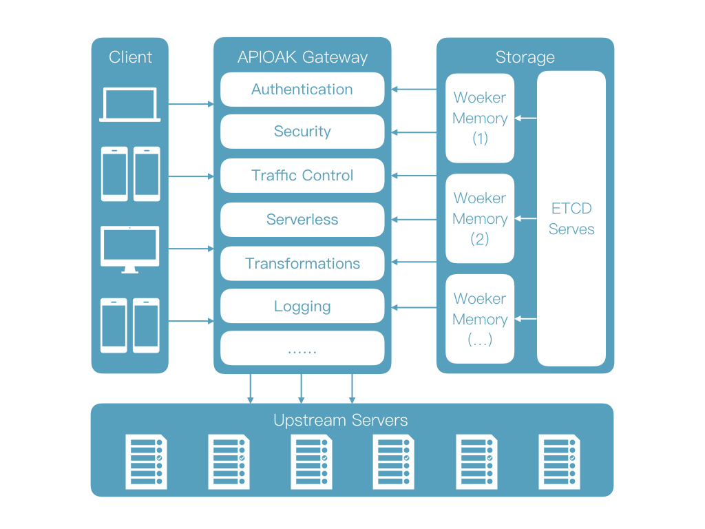

# APIOAK

 
APIOAK 提供API发布、管理、运维的全生命周期管理。辅助用户简单、快速、低成本、低风险的实现微服务聚合、前后端分离、系统集成，向合作伙伴、开发者开放功能和数据。

# 为什么选择APIOAK

如果你正在构建网站、APP应用，那么你可能需要使用API网关来处理接口流量。

APIOAK适用于中小企业的API管理，无需开发，开箱即用。

# 功能

 - **运行环境**：Openresty。
 - **热更新和热插件**：无需重启服务，就可以持续更新配置和插件。
 - **动态负载均衡**：动态支持 round-robin / hash 负载均衡。
 - **代理请求重写**：支持重写请求上游的headers、query、path信息。
 - **限制速率**
 - **限制请求数**
 - **限制并发**
 - **自定义插件**: 允许挂载常见阶段，例如`rewrite`,`access`,`header filter`, `body filter` 和 `log`
 - **CLI**: 使用命令行启动、关闭和重启APIOAK
 - **可扩展**: 简单易用的插件机制方便扩展
 - **REST API**
 
# 安装

[安装文档](doc/dev-manual-cn.md)

# 文档

 1. 后台API文档
   - [service](doc/service-cn.md)
   - [router](doc/router-cn.md)
   - [plugin](doc/plugin-cn.md)
   
 2. 插件文档
   - 正在更新...
    
## 致谢

