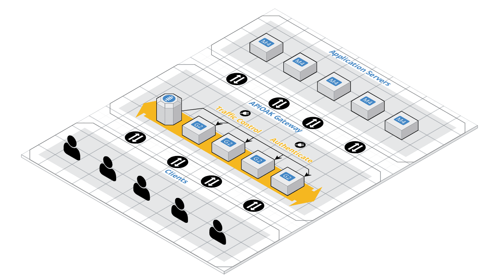
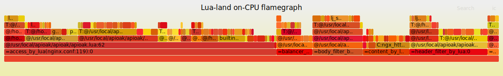

[简体中文](README_CN.md) | [English](README.md) 

# APIOAK

[](https://travis-ci.org/apioak/apioak)
[](https://github.com/apioak/apioak/blob/master/LICENSE)
 
APIOAK 提供API发布、管理、运维的全生命周期管理。辅助用户简单、快速、低成本、低风险的实现微服务聚合、前后端分离、系统集成，向合作伙伴、开发者开放功能和数据。


## 为什么选择APIOAK

APIOAK 提供了几乎可以媲美原生 `Nginx` 的强劲性能，通过插件机制提供动态身份认证、流量控制等功能，并支持根据特定业务场景的自定义插件。同时还提供了多种动态负载均衡策略和功能强大易用的控制台管理面板。




## 功能

- **项目**

    - 支持项目前缀，用于多租户隔离。
    
    - 支持多环境环境配置，`生产环境`、`预发环境`、`测试环境` 不同环境完全隔离，满足`持续集成`、`持续交付`的全生命周期管理。
    
    - 支持动态加权的 `round-robin` 负载均衡。
    
    - 支持动态一致性 `hash` 负载均衡。
    
    - 支持动态节点配置，动态 `Host` 配置。
    
    - 支持上游服务 `连接`、`发送`、`读取` 超时设置。
    
    - 支持插件热插拔，项目插件可被项目下所有路由继承。
    
    - 支持自动生成项目文档。
    
    - 支持项目成员管理。

- **路由**

    - 支持前后端请求路由映射。
    
    - 支持前后端请求方式映射。
    
    - 支持前后端请求参数交叉映射。
    
    - 支持常量参数定义。
    
    - 支持自定义响应数据及响应数据类型。
    
    - 支持插件热插拔。
    
    - 支持 `Mock` 请求，加速前后端分离开发过程。
    
    - 支持自动生成路由（APIs）文档。
    
    - 支持多环境路由（APIs）上下线。
    
    - 支持多环境路由（APIs）一键复制。
    
- **用户**

    - 支持用户登录、注册。
    
    - 支持用户创建、编辑、删除。
    
    - 支持用户全局禁用。


## 安装

在不同的操作系统上安装 `APIOAK` 所必需的系统依赖（`OpenResty >= 1.15.8.2`、`luarocks >= 2.3`、`MySQL >= 5.7 或 MariaDB >= 10.2`等），请参见：[依赖安装文档](doc/zh_CN/install-dependencies.md)。

> 通过 LuaRocks 安装

```shell
sudo luarocks install apioak
```

请在 [发行列表](https://gitee.com/apioak/apioak/releases) 中获得相应版本的 `RPM` 或 `DEB` 安装包。

> 通过 PRM 安装 (CentOS 7)

```shell
sudo yum -y install aoioak-{VERSION}-1.el7.x86_64.rpm
```

> 通过 DEB 安装 (Ubuntu 18)

```shell
sudo dpkg -i apioak-{VERSION}-1_amd64.deb
```


## 快速开始

> 配置 APIOAK

 - 导入数据库配置文件到 `MySQL` 或 `MariaDB` 中，配置文件路径 `/path/conf/apioak.sql`。
 
 - 编辑 `APIOAK` 配置文件中 `database` 项的数据库连接信息，配置文件路径 `/path/conf/apioak.yaml`。


> 启动 APIOAK

```bash
sudo apioak start
```

> 访问 APIOAK

- 浏览器输入 `http://127.0.0.1:10080/apioak/dashboard` 即可访问控制台管理面板。

至此，`APIOAK` 已全部安装并配置完毕，请尽情享受。


## 性能

> 测试环境和参数

- 使用Google Cloud N1系列基础版（1 vCPU + 3.75 GB RAM）服务器进行测试。

- 使用2个线程运行基准测试20秒，保持200个HTTP连接打开。

> 平均响应时间（RTT）和每秒响应次数（QPS）

```bash
Thread Stats   Avg      Stdev     Max   +/- Stdev
Latency       2.65s   584.41ms   3.66s    57.25%
Requests/sec:  24012.38
```

> 请求响应时间分布

```bash
 50.000%    2.63s 
 75.000%    3.18s 
 90.000%    3.44s 
 99.000%    3.60s 
 99.900%    3.64s 
 99.990%    3.65s 
 99.999%    3.66s 
100.000%    3.66s
```

## 火焰图




## 致谢


